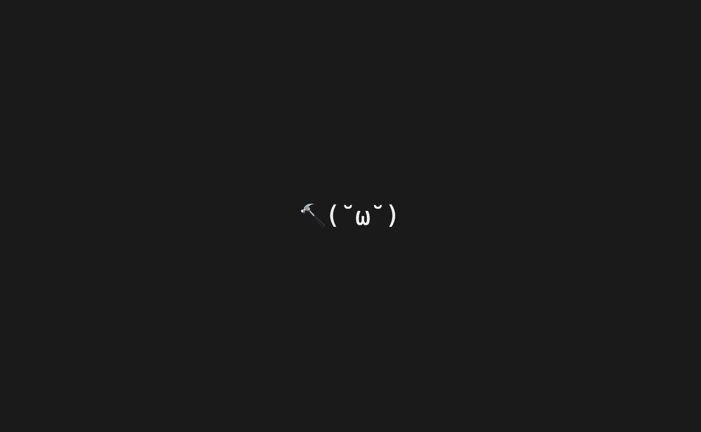

# claude-pet — 看你写代码长大的终端电子宠物 🐾

一只活在 **Claude Code 底部状态行**的像素电子宠物:**半块字符 ▀/▄ 渲染的彩色 chibi**(ANSI 24-bit)——单格漫画(角色 + 跟状态变的小场景 + 对话框),靠你写代码"喂养"成长、按活计**转职**、升级、转生,还能 `/pet` 跟她唠嗑、逛**积分商城**买帽子。零脱节(就在你盯着的窗口里),不出广告,纯陪伴。

> 灵感取自 kickbacks.ai 的反面(把思考 spinner 卖成广告位)——我们要陪伴的小人,不是广告。



## 安装(GitHub 拉代码,**不需 npm 包**)

需要 **Node.js**(任意近代版本)和 **Claude Code**。`dist/` 已随仓库构建好,克隆即用:

```bash
git clone https://github.com/xemaya/claude-pet.git
cd claude-pet
node bin/cli.mjs install     # 合并 statusLine + 6 hooks + /pet 命令 进 ~/.claude/settings.json(自动备份)
```

**新开 / 刷新一个 Claude Code 窗口**即见。卸载:`node bin/cli.mjs uninstall`(成长存档 `~/.claude-pet/` 不删)。

> 让你的 Claude Code 帮你装:把这段 README 丢给它,说"按 README 装上并按我的喜好改人设/台词"即可——下面的自定义点它都能改。

## 跟她互动:`/pet`

| 命令 | 作用 |
|---|---|
| `/pet 今天好累啊` | 跟她唠嗑,她在状态栏对话框回你(在当前会话里由 Claude 扮她生成,约几秒) |
| `/pet 👍` / `/pet 👎` | 即时反应:点头 / 摇头(本地秒回,不调模型) |
| `/pet help` | 玩法菜单 |
| `/pet shop` · `/pet 买草帽` · `/pet 戴猫耳` · `/pet 脱` | 逛积分商城 / 买装扮 / 佩戴 / 摘下 |
| `/pet 爱心` · `/pet 烟花` | 买临时特效(头顶飘几秒) |
| `/pet reset` | 转生:清成长回新人重抽职业、**周目+1**(衣橱保留) |

她还会**空闲时主动冒话**(玩法提示 / 偶尔回忆你说过的话)。

## 它怎么长

- **喂养 / XP**:完成一轮对话 +5,每次工具调用 +1(食物 = 你干的活)。
- **阶段**:`150` 新人→见习 · `1200` 见习→**转职**定型 · `6000`→**成体**(称号加"大"+ 头顶金冠)。
- **转职**(过 evolveXp 那刻按累计活计定型并锁):🔨 工匠(Edit/Write 多)· 🔍 侦探(Bash 多)· 📖 学者(Read/Grep 多)· ⚖️ 全能(均衡)。
- **等级 Lv**:指数曲线,每级所需是上一级 2 倍。**里程碑 ✦** 在 1500/4000/10000/22000/50000。
- **漫画场景**(右侧跟状态变):🍪 投食 · 📦 转职开宝箱 · ⚔️ 报错打 bug · 🧱 工匠搬砖 · 📕 学者看书 · 💤 空闲打盹。
- **积分商城 🪙**:金币只在**完成一轮对话** +1(工具不产币,故慢慢攒),**花币不动 xp**(成长纯净);买帽子(永久,戴头顶)+ 零食特效(临时)。转生清币留衣橱。难度都在 `src/core/config.ts` + `src/core/coins.ts` 可调。
- **纯正向**:不喂不会饿/死/退,空闲就打盹等你。

## 自定义(都能改,改完 `npm install && npm run build`)

| 想改 | 改哪 |
|---|---|
| **人设/口吻**(她怎么说话) | `commands/pet.md`(改完重装 `node bin/cli.mjs install`) |
| **空闲台词 / 玩法提示** | `src/view/captions.ts` |
| **商城商品 / 价格 / 帽子像素** | `src/view/shopItems.ts` |
| **金币/经验数值、阈值** | `src/core/config.ts`、`src/core/coins.ts` |
| **道具像素** | `src/view/props.ts` |
| **形象皮肤** | 见下方"换皮肤" |

> 仅改 `commands/pet.md`(人设)、`tools/*.sh` 不需要重新 build;改 `src/` 下的 TS 才需 `npm install && npm run build`。

### 换皮肤

默认是 **CC0 动物**(可自由分发)。想要 chibi 美少女(**PIPOYA 32×32**,免费可商用但禁止再分发,故不随仓库):

1. 去 https://pipoya.itch.io/pipoya-free-rpg-character-sprites-32x32 下载,解出 `Female_*.png`。
2. `python3 tools/bake-girls.py <Female目录>` → 烘焙到 `~/.claude-pet/skin.json`(只在你本机,运行时优先加载)。
3. 删 `~/.claude-pet/skin.json` 回到默认动物。任意 6 形态 16/32px PNG 仿此即可。

## 架构(一句话)

`hooks → ~/.claude-pet/events.jsonl(追加) → 状态行每次刷新:从完整日志纯 fold 出状态(无状态投影,不写文件)→ 半块渲染像素场景`。

- 纯函数 reducer `(state,event)→state'`(`src/core/`),与渲染彻底分离。
- **多窗口**:所有窗口共享同一份 events.jsonl,各自无状态重算 → 同一只全局宠物、零写竞争。
- `/pet` 聊天 = 当前会话里 Claude 扮她生成 + `tools/pet-say.sh` 写 `say.json`;商城 = `dist/shop.mjs` 读 events+wallet 算账。

## 验证 / 开发

```bash
npm install               # 仅开发/改 src 时需要(装 esbuild 等)
npm test                  # 95+ 纯逻辑单测
npm run build             # 重建 dist/(statusline + shop)
npm run verify:statusline # ship 门:六形态渲染各异 + 台词轮换 + 对话框
```

## 已知限制(诚实)

- **形象动效靠几何位移**(呼吸/点头/摇头):脸是单帧贴图,不能眨眼/动嘴(要多帧美术)。
- **刷新节奏由 Claude 控**(每 session 各自,空闲约 3s):本质是"每刷新一格漫画",做不到连续动画;无状态投影保证"一刷新就准"。
- `/pet` 聊天是当前会话的一次 LLM 回合(会留一行工具调用、约几秒),这是斜杠命令的固有代价。
- `events.jsonl` 不裁剪会缓慢增长(事件很小,长期再压缩)。

## 许可

代码 **MIT**。默认动物皮肤 **CC0**(见 [CREDITS.md](CREDITS.md))。PIPOYA 皮肤不随仓库分发(禁转售),只能你本机烘焙。
